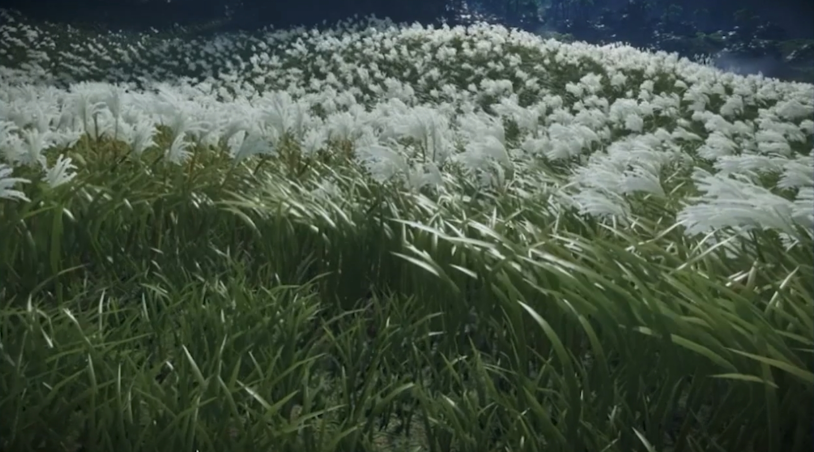
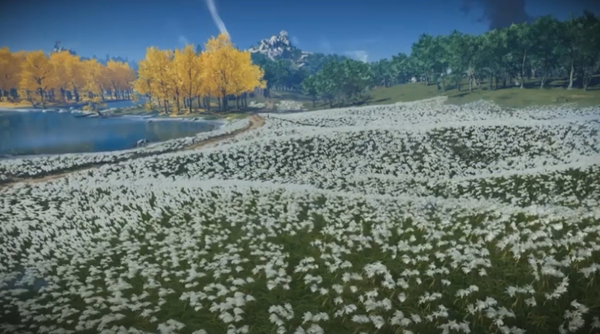

# Procedural Grass - CIS 566 Final Project

## Zhen Ren

### Usage

Please use cmake to compile the code. Make sure your device has a discrete GPU and support Vulkan 1.3.

### Hot Keys

| Keys| Usage               |
|-----|---------------------|
| ESC | Quit |
| C   | Toggle Cloud Render                       |
| R   | Toggle Reeds Render                       |
| S   | Toggle Grass Render                       |
| 1   | Switch to theme **Eventide Farewell**     |
| 2   | Switch to theme **Night Sky's Grace**     |
| 3   | Switch to theme **Fresh Breezes of Dawn** |
| 4   | Switch to theme **The Fading Stories**    |

### Introduction

Grass system is a important part in many games. Lush, realistic grass helps bring the environment to life. When the grass moves in response to weather or characters, it can draw players further into the world.

The open-world action game **Ghost of Tsushima** has an amazing grass and foliage system. Combined with its weather system, waving grass really builds up the solace atmosphere.

In this project, I plan to reimplement the procedural grass system in **Ghost of Tsushima** using a Vulkan grass template.

### Reference Image

### Technical reference

[Procedural Grass in 'Ghost of Tsushima'](https://www.youtube.com/watch?v=Ibe1JBF5i5Y)

### Features Breakdown

To recreate the visuals in the reference image, I plan to achieve these features:

- Procedural wind field
- Bezier curve based grass
- Procedural grass normal and glossiness
- Procedural grass clump
- Procedural environment lighting and sky
- Waving reed
- Procedural Terrain
- Anti Aliasing

## Milestone 1 Progress

- Refactored the base code to use indirect index draw
- Procedural wind Bezier curve based grass
- Procedural Terrain
- MSAA

## Milestone 2 Progress

- Procedural grass normal and glossiness
- Procedural grass clump
- Procedural environment lighting and sky

## Milestone 3 Progress

- Waving reed
- Additional features for live demo
  - Sky toggle
  - Reeds toggle
  - Grass toggle
  - 4 Themes

